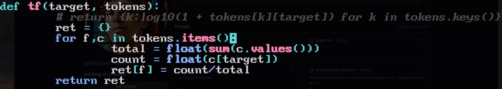
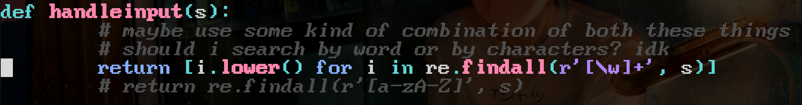

# SrchNgin
- local files search engine in python
- prefer the standard term frequency over logarithmic term frequency

- dividing the user input based into individual words instead of individiual characters

## Challenges:
- having problems with the implementation
- figuring out how to implement the algorithm over a large set of documents
- finally figured out the basic search engine. YIPEE!!

## TODO:
- [x] read text files
- [x] tokenize files
- [x] implement tfidf
- [ ] make a user interface using flask
- [ ] add the ability to search in any folder
- [ ] make the thing recursive
